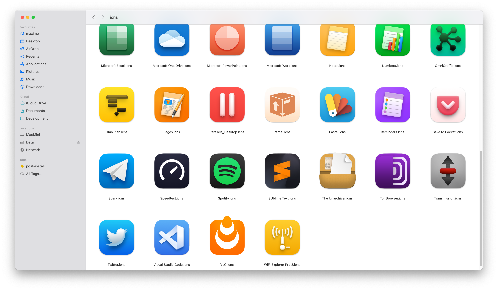

# Custom Icons Setup

 Simple script to batch save/set your custom app's icons

You can customize it, the filename of the icon just has to match the app's one.

It will also install homebrew in the unlikely case you don't have already installed it, plus fileicon's binary.

Make executable and run:
`
chmod +x setup.sh && ./setup.sh
`

To-do:
- Wait for sommeone to pull request a mitigation for system's app as well (i'm on it but I don't think there is another way to write mount the cryptographic sealed /System directory which is includes is obvously not scriptable and can't fully be signed afterward.
- Implement saving
- Pass option to select a given set of icons
- Maybe ability to handle svg/png input...
- Maybe automate iconsets creation...